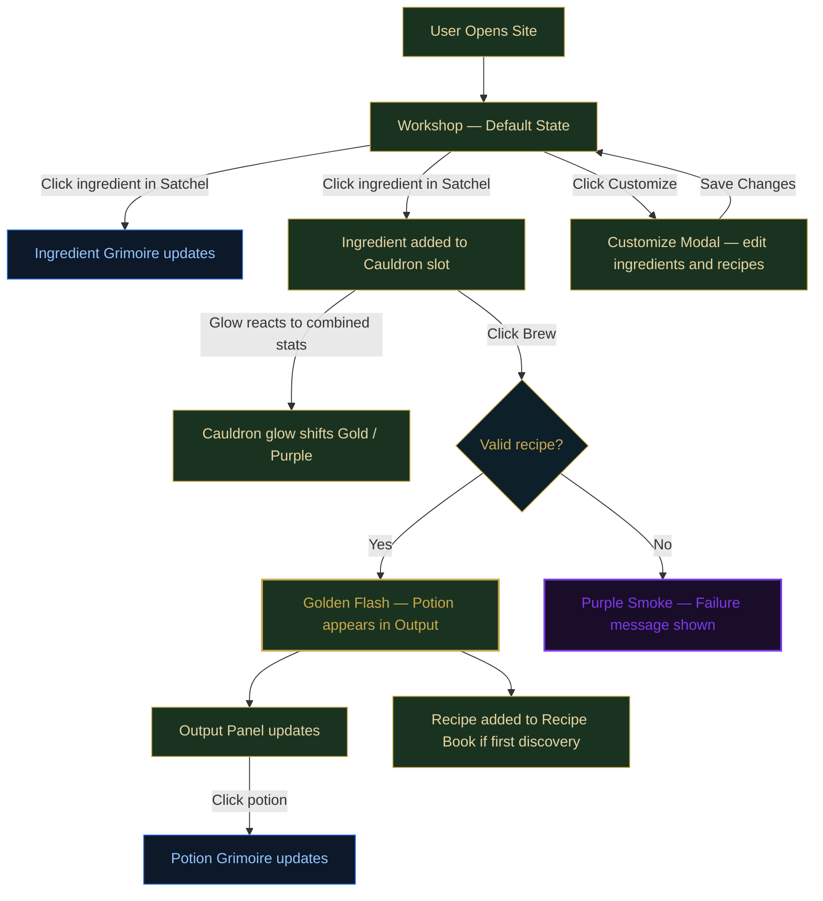

# Alchemist's Workshop

A reactive, browser-based interface framework built in React — designed to be fully customizable by the user. The Alchemist's Workshop potion brewer is the example implementation, demonstrating what the system is capable of, but the underlying architecture is built to support any domain a user wants to bring to it.

Users can define their own items, recipes, and outputs through the Customize modal, effectively replacing the potion-brewing theme with any game, system, or concept they choose. A future Settings panel will allow visual customization of the interface itself — colors, fonts, and layout — so the entire experience can be reskinned without touching code.

The potion brewer is the proof of concept. The framework is the product.

## Features
- **Reactive Panel Architecture:** Satchel, Cauldron, Output, and dual Grimoire panels all share a single source of truth in App.jsx — no data duplication across components.
- **JSON-Driven Data Layer:** All ingredients and recipes are defined in a central data file. Stats, names, descriptions, and combo flags are driven entirely by the data model.
- **Ingredient Count System:** The Satchel tracks available counts per ingredient and reacts visually when the Cauldron consumes them — demonstrating live Browser → Controller reactivity.
- **Recipe Discovery:** Recipes are hidden until successfully brewed for the first time. The Recipe Book is a living log of discovered combinations, not a pre-filled reference guide.
- **Reactive Cauldron Glow:** The Cauldron's glow color shifts from white → gold (potency) or purple (toxicity) based on the combined stats of slotted ingredients.
- **Brewing Feedback:** Success emits a Golden Flash; failure emits Chromatic Aberration + Purple Smoke. Transitions use a `0.8s cubic-bezier(0.22, 1, 0.36, 1)` for a weighty, magical feel.
- **Live Essence Readout:** While ingredients are slotted, animated Potency and Toxicity bars show the combined stat averages in real time, with a proximity hint that updates as the formula approaches a known recipe.
- **Stat Bloom:** Potency and Toxicity values in the Grimoires emit layered `drop-shadow` glow proportional to their numeric value — high stats visibly bleed light onto the surrounding panel.
- **Dual Grimoire System:** Hovering an ingredient previews it in the Ingredient Grimoire; hovering a brewed potion previews it in the Potion Grimoire. Clicking a potion pins it.
- **Individual Slot Removal:** Clicking a filled Cauldron slot returns that ingredient to the Satchel.
- **Customize Modal:** Users can define their own ingredients, recipes, and outputs to build a custom brewing interface for any game domain.
- **Settings Modal:** 4 theme presets (Arcane, Crimson, Verdant, Void), live color pickers, font selector, and spacing slider — all changes write to CSS custom properties and persist via `localStorage`.
- **Import / Export:** *(Coming soon)* Save and load custom ingredient and recipe sets.

## User Flow Diagram

## AI Direction & Collaborative Guidance
*This section documents key moments where the Lead Designer (Connor) steered the AI's technical execution to match a specific aesthetic vision.*

1. **React Migration**
   - **Asked:** Migrate from vanilla JS to React + Vite to align with the course spec's useState + props requirements.
   - **Produced:** Proposed two options — Vite rewrite or CDN drop-in.
   - **Decided:** Designer chose Vite with a GitHub Actions deploy pipeline.

2. **Font Selection**
   - **Asked:** Guidance on choosing between Uncial Antiqua and IM Fell English.
   - **Produced:** Framed the tradeoff as loud magical (Uncial) vs. quiet diegetic (IM Fell).
   - **Decided:** Designer chose IM Fell English — fits the "real in-world object" direction better than a genre font.

3. **Recipe Discovery Mechanic**
   - **Asked:** Recipes should be hidden and only appear in the Recipe Book after first successful brew.
   - **Produced:** Proposed a `discovered` flag on each recipe and dynamic Recipe Book rendering.
   - **Decided:** Designer confirmed — turns the Recipe Book into a living discovery log.

4. **Glow Color System**
   - **Asked:** Define distinct glow colors for the two panel types.
   - **Produced:** Proposed silver-blue for Grimoires to contrast the interactive gold.
   - **Decided:** Designer upgraded to Arcane Blue — more atmospheric. Satchel + Output share Muted Gold; both Grimoires share Arcane Blue; Cauldron is reactive white/gold/purple.

5. **Card Glow Directionality**
   - **Asked:** Ingredient and potion cards needed distinct hover states.
   - **Produced:** Proposed a single rotating border-glow animation for all cards.
   - **Decided:** Designer split them — ingredients use a directional side-sweep (`card-glow-gold`/`card-glow-purple`) and potions use an omnidirectional pulse (`potion-hover-pulse`). Reflects the difference between tools you reach for vs. things you've created.

6. **World-Language Flavor Text**
   - **Asked:** Brew messages felt too much like UI copy.
   - **Produced:** Rewrote all three states in in-world arcane register: "More essences are required." / "The essences resist each other — no formula takes hold." / "[Name] has been drawn forth!"
   - **Decided:** Designer confirmed — no interface language, only the voice of the workshop itself.

7. **Settings Modal: From Placeholder to Functional**
   - **Asked:** The Settings modal was a disabled stub; make it fully functional.
   - **Produced:** 4 theme presets (Arcane, Crimson, Verdant, Void), live color pickers, font selector, spacing slider — all wired to CSS custom properties and `localStorage`.
   - **Decided:** Designer confirmed — the settings system now covers the full visual customization spec from DesignDoc.md without touching code.

8. **Evaluating an External Directive**
   - **Asked:** Review a Gemini-generated "Master Implementation Directive" and assess what was worth building.
   - **Produced:** Identified what was already implemented, what conflicted with the existing arcane palette, and isolated four genuinely new ideas: film grain, chromatic aberration, screen shake, stats bloom.
   - **Decided:** Designer kept the current palette, dropped film grain and screen shake, kept chromatic aberration and stats bloom — two targeted additions tied directly to data rather than pure decoration.

9. **Proximity Hint as In-World Feedback**
   - **Asked:** Fill the empty lower half of the Cauldron panel with something meaningful.
   - **Produced:** Proposed a live essence readout (stat bars) and a recipe proximity hint as two complementary layers.
   - **Decided:** Designer confirmed both — the bars make the glow system legible and the hint text stays atmospheric ("Something stirs in the confluence...") without spoiling undiscovered recipes.

10. **Hover vs. Click Separation**
    - **Asked:** The Ingredient Grimoire should update on hover, not click — because clicking already adds to the Cauldron.
    - **Produced:** Separated `onMouseEnter` (grimoire preview) from `onClick` (cauldron add) in Satchel. Extended the same pattern to Output: hover previews the Potion Grimoire, click pins the selection.
    - **Decided:** Designer confirmed — both panels now follow the same hover-to-inspect, click-to-act logic, which makes the interaction model consistent across the whole workshop.

11. **Why CSS Variable Themes Weren't Enough**
    - **Asked:** Add a Skyrim theme preset so we can compare it against the original look.
    - **Produced:** Added the preset to SettingsModal — it looked nearly identical to Arcane because most visual appearance (panel backgrounds, border colors, orbs) is hardcoded in CSS, not driven by variables. Switched to a body class approach (`theme-skyrim`) so a full CSS override block could replace every hardcoded value.
    - **Decided:** Designer confirmed the body class approach was the right call. The lesson: CSS variable theming only works if the full design is variable-driven from the start.

12. **SkyUI as the Visual North Star**
    - **Asked:** Full visual overhaul — make it feel like an alchemy station in a video game, not a website. Reference: SkyUI mod for Skyrim.
    - **Produced:** Replaced the wood-gradient panel system with flat dark opaque panels, hid the floating orbs and sparkles, added the Skyrim wallpaper as background, unified the panel language around a single dark surface with amber/steel accents, gave the cauldron a stronger border to elevate it as focal point.
    - **Decided:** Designer confirmed direction. Key constraint established: opaque panels, minimal but present decorative flourishes, keep IM Fell English, cauldron more decorated but not extreme.

## Records of Resistance
*This section tracks AI output that was rejected or required designer intervention to correct.*

1. **Cauldron glow persisted after CSS fix** — Removing the glow from the cauldron panel via CSS had no effect because `computeCauldronGlow()` in App.jsx applies an inline `boxShadow` style that wins over any CSS rule. Required a separate fix in the JS logic to return `'none'` for the empty state. CSS-only thinking missed the inline style override entirely.

2. **Skyrim preset looked identical to Arcane** — First attempt at the Skyrim theme only swapped CSS variable values. Since most of the visual appearance is hardcoded (panel backgrounds, orb colors, border colors), the result was indistinguishable from the original. Required a full body class override system to actually change the appearance. The variable-only approach was technically correct but practically useless.

3. **Description text size changes had no visible effect** — Multiple attempts to increase the description text via `section p, section li` appeared to have no effect in the browser. Root cause was likely a combination of browser caching and the user viewing idle state text (`.grimoire-idle-text`) which has its own more specific rule. Required targeting `#grimoire-content > p` directly.

## Five Question Reflection

1. **Can I defend this?** Can I explain every major decision in this project?

2. **Is this mine?** Does this reflect my creative direction, or did I mostly follow AI's suggestions?

3. **Did I verify?** Did I check that the three panels actually share state and that the reactive connections work?

4. **Would I teach this?** Do I understand the props-down / events-up pattern well enough to explain it to a classmate?

5. **Is my documentation honest?** Does the AI Direction log accurately describe what I asked and what I changed?

## Technical Details
- **Architecture:** React 18 + Vite
- **State Management:** `useState` + props (lifted state in App.jsx — no Context or Redux)
- **Styling:** CSS3 with keyframe animations and `cubic-bezier` transitions
- **Typography:** IM Fell English (Google Fonts)
- **Data:** JSON-driven ingredient and recipe system in `src/data.js`
- **Deploy:** GitHub Actions → GitHub Pages

## Project Structure
- `src/App.jsx` — Single source of truth; all state lives here
- `src/components/Satchel.jsx` — Ingredient browser (Browser panel)
- `src/components/IngredientGrimoire.jsx` — Ingredient detail view (left Detail panel)
- `src/components/PotionGrimoire.jsx` — Discovered potion detail view (right Detail panel)
- `src/components/Cauldron.jsx` — Brewing controller (Controller panel)
- `src/components/Output.jsx` — Brewed potion results
- `src/components/CustomizeModal.jsx` — User-defined ingredient and recipe editor
- `src/components/SettingsModal.jsx` — Theme presets, live color pickers, font selector, spacing slider
- `src/data.js` — Ingredient and recipe data model
- `src/index.css` — All styling and animations
- `DesignDoc.md` — Living collaborative design document (Connor + Claude)
- `AI_Actions.md` — Full log of every task requested during the project
- `Images/` — 

<!-- Documentation: Project overview and designer-led records -->
