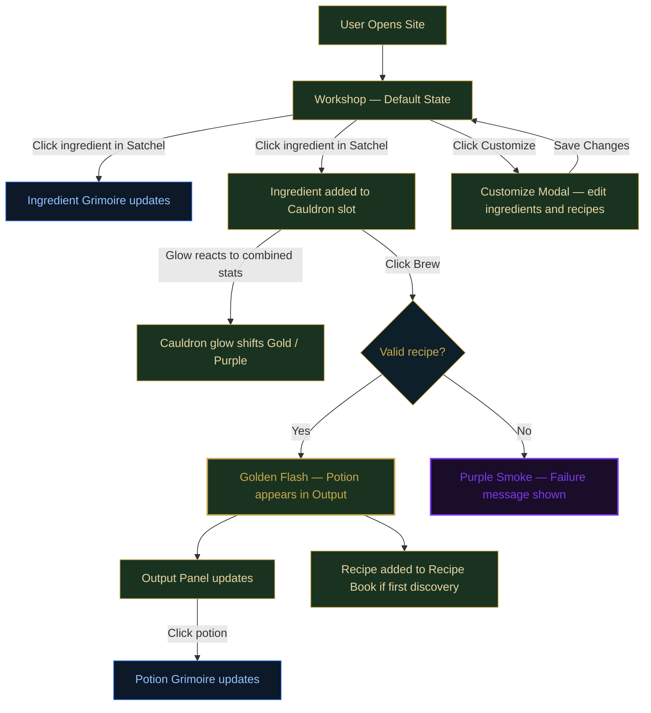

# Alchemist's Workshop

A reactive, browser-based interface framework built in React — designed to be fully customizable by the user. The Alchemist's Workshop potion brewer is the example implementation, demonstrating what the system is capable of, but the underlying architecture is built to support any domain a user wants to bring to it.

Users can define their own items, recipes, and outputs through the Customize modal, effectively replacing the potion-brewing theme with any game, system, or concept they choose. A future Settings panel will allow visual customization of the interface itself — colors, fonts, and layout — so the entire experience can be reskinned without touching code.

The potion brewer is the proof of concept. The framework is the product.

## Features
- **Reactive Panel Architecture:** Satchel, Cauldron, Output, and dual Grimoire panels all share a single source of truth in App.jsx — no data duplication across components.
- **JSON-Driven Data Layer:** All ingredients and recipes are defined in a central data file. Stats, names, descriptions, and combo flags are driven entirely by the data model.
- **Ingredient Count System:** The Satchel tracks available counts per ingredient and reacts visually when the Cauldron consumes them — demonstrating live Browser → Controller reactivity.
- **Recipe Discovery:** Recipes are hidden until successfully brewed for the first time. The Recipe Book is a living log of discovered combinations, not a pre-filled reference guide.
- **Reactive Cauldron Glow:** The Cauldron's glow color shifts from white → gold (potency) or purple (toxicity) based on the combined stats of slotted ingredients.
- **Brewing Feedback:** Success emits a Golden Flash; failure emits Purple Sputtering Smoke. Transitions use a `0.8s cubic-bezier(0.22, 1, 0.36, 1)` for a weighty, magical feel.
- **Dual Grimoire System:** Selecting an ingredient updates the Ingredient Grimoire (left); selecting a brewed potion updates the Potion Grimoire (right).
- **Customize Modal:** Users can define their own ingredients, recipes, and outputs to build a custom brewing interface for any game domain.
- **Import / Export:** *(Coming soon)* Save and load custom ingredient and recipe sets.
- **Settings / Design Modal:** *(Coming soon)* User-facing visual customization controls.

## User Flow Diagram

## AI Direction & Collaborative Guidance
*This section documents key moments where the Lead Designer (Connor) steered the AI's technical execution to match a specific aesthetic vision.*

1. **Splitting the Grimoire**
   - **Asked:** Add a recipe book section to the Grimoire without changing its size.
   - **Produced:** Proposed a single panel split 50/50 internally.
   - **Decided:** Designer directed the split, establishing the read-only right half as a static recipe reference.

2. **Customize Modal UX Refinement**
   - **Asked:** The "Apply & Wipe" button felt misleading if only adding one item.
   - **Produced:** Proposed pre-loading current data on open so it behaves as an editor.
   - **Decided:** Designer approved the editor approach; button renamed to "Save Changes."

3. **React Migration**
   - **Asked:** Migrate from vanilla JS to React + Vite to align with the course spec's useState + props requirements.
   - **Produced:** Proposed two options — Vite rewrite or CDN drop-in.
   - **Decided:** Designer chose Vite with a GitHub Actions deploy pipeline.

4. **Font Selection**
   - **Asked:** Guidance on choosing between Uncial Antiqua and IM Fell English.
   - **Produced:** Framed the tradeoff as loud magical (Uncial) vs. quiet diegetic (IM Fell).
   - **Decided:** Designer chose IM Fell English — fits the "real in-world object" direction better than a genre font.

5. **Reactive Cauldron Glow**
   - **Asked:** Cauldron should have a white base glow that reacts to ingredient stats.
   - **Produced:** Proposed gold/purple shift based on combined potency and toxicity with intensity scaling.
   - **Decided:** Designer confirmed — ties the visual system directly to the data model.

6. **Recipe Discovery Mechanic**
   - **Asked:** Recipes should be hidden and only appear in the Recipe Book after first successful brew.
   - **Produced:** Proposed a `discovered` flag on each recipe and dynamic Recipe Book rendering.
   - **Decided:** Designer confirmed — turns the Recipe Book into a living discovery log.

7. **Glow Color System**
   - **Asked:** Define distinct glow colors for the two panel types.
   - **Produced:** Proposed silver-blue for Grimoires to contrast the interactive gold.
   - **Decided:** Designer upgraded to Arcane Blue — more atmospheric. Satchel + Output share Muted Gold; both Grimoires share Arcane Blue; Cauldron is reactive white/gold/purple.

## Records of Resistance
*This section tracks AI output that was rejected or required designer intervention to correct.*

1. 

2. 

3. 

## Five Question Reflection

1. **Can I defend this?** Can I explain every major decision in this project?

2. **Is this mine?** Does this reflect my creative direction, or did I mostly follow AI's suggestions?

3. **Did I verify?** Did I check that the three panels actually share state and that the reactive connections work?

4. **Would I teach this?** Do I understand the props-down / events-up pattern well enough to explain it to a classmate?

5. **Is my documentation honest?** Does the AI Direction log accurately describe what I asked and what I changed?

## Technical Details
- **Architecture:** React 18 + Vite
- **State Management:** `useState` + props (lifted state in App.jsx — no Context or Redux)
- **Styling:** CSS3 with keyframe animations and `cubic-bezier` transitions
- **Typography:** IM Fell English (Google Fonts)
- **Data:** JSON-driven ingredient and recipe system in `src/data.js`
- **Deploy:** GitHub Actions → GitHub Pages

## Project Structure
- `src/App.jsx` — Single source of truth; all state lives here
- `src/components/Satchel.jsx` — Ingredient browser (Browser panel)
- `src/components/Grimoire.jsx` — Ingredient + Potion detail views (Detail panel)
- `src/components/Cauldron.jsx` — Brewing controller (Controller panel)
- `src/components/Output.jsx` — Brewed potion results
- `src/components/CustomizeModal.jsx` — User-defined ingredient and recipe editor
- `src/components/SettingsModal.jsx` — Visual customization controls *(placeholder)*
- `src/data.js` — Ingredient and recipe data model
- `src/index.css` — All styling and animations
- `DesignDoc.md` — Living collaborative design document (Connor + Claude)
- `AI_Actions.md` — Full log of every task requested during the project
- `Images/` — 

<!-- Documentation: Project overview and designer-led records -->
