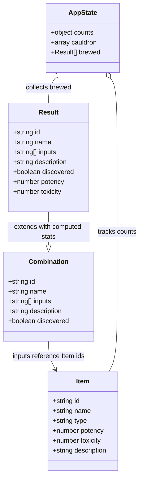

# Alchemist's Workshop

A reactive, browser-based interface framework built in React — designed to be fully customizable by the user. The Alchemist's Workshop potion brewer is the example implementation, demonstrating what the system is capable of, but the underlying architecture is built to support any domain a user wants to bring to it.

Users can define their own items, recipes, and outputs through the **Customize** modal, effectively replacing the potion-brewing theme with any game, system, or concept they choose. Custom data persists across page refreshes via `localStorage` and can be exported as a JSON file and re-imported at any time.

The **Theme Settings** modal gives full visual control over the interface without touching code. It is split into three tabs: **Theme** — which offers five built-in presets (Magical & Mystical, Skyrim, Crimson Sanctum, Verdant Workshop, Void), live color pickers for borders and stats, a font selector, spacing slider, custom background upload, and theme export/import — **Header** — which controls the header bar background, height, title size, accent glow color, and the animated header effect (Stars, Embers, Scanlines, or None) — and **Labels** — which lets users rename the site title, all five panel headers, and the Brew and Dispel buttons so the workshop can be reskinned for any domain.

The potion brewer is the proof of concept. The framework is the product.

## Features
- **Reactive Panel Architecture:** All five panels share a single source of truth — no data duplication.
- **JSON-Driven Data Layer:** Items and combinations are defined in a central `src/data.json` file. Custom data can be exported, edited, and re-imported through the Customize modal and persists across refreshes.
- **Item Count System:** The Browser panel tracks per-item counts and reacts visually as the Controller consumes them.
- **Combination Discovery:** Combinations are hidden until successfully executed. The discovery log is a living record of found formulas, not a pre-filled reference.
- **Reactive Controller Visuals:** The Controller's glow and sigil shift color based on the combined stats of slotted items, using the user's chosen stat colors.
- **Action Feedback:** Success emits a Golden Flash; failure emits Chromatic Aberration and Purple Smoke.
- **Live Stat Readout:** Animated stat bars show combined averages in real time, with a proximity hint as the selection nears a known combination.
- **Stat Bloom:** Stat values in the Detail panels emit a glow proportional to their numeric value — high stats visibly bleed light onto the surrounding panel.
- **Dual Detail Panel System:** Hovering an item previews it in the Item Detail panel; hovering an output previews it in the Output Detail panel. Clicking pins the selection. The Output Detail panel shows the full recipe inputs alongside stats.
- **Browser Sort Toggle:** A compact cycle button in the Browser panel footer (beside the Restock button) sorts items by name (A–Z), first stat (high first), or second stat (high first) without changing the panel layout.
- **Individual Slot Removal:** Clicking a filled Controller slot returns that item to the Browser panel.
- **Three-Tier Panel Color Language:** Panels are grouped by role — Controller in deep indigo-violet, Browser and Output in gold, Detail panels in steel blue.
- **Customize Modal:** Define your own items, combinations, and outputs without touching code. Includes a slot count toggle (4 or 8) to expand the Controller for more complex combinations.
- **Theme Settings Modal:** Four tabs — **Theme** (5 presets, color pickers for every panel surface and stat, font selector, spacing slider, background upload, theme export/import), **Header** (background, height, title size, glow color, animated effect picker), **Labels** (rename the site title, all panel headers, and action buttons), and **Flavor Text** (edit every piece of atmospheric copy on the site: brew outcome messages, proximity hints, cauldron counter text, and all four panel idle messages). Template placeholders (`{name}`, `{count}`, `{total}`) supported. All flavor text is included in theme export/import and wiped by Reset to Default.
- **Import / Export:** Export and re-import the full item and combination set as a JSON file.
- **Tutorial Modal:** A `?` button in the header opens a concise six-section guide covering all five panels and both modals, written in the workshop's in-world register.

## Data Structure Diagram

## AI Direction & Collaborative Guidance
*This section documents key moments where the Lead Designer (Connor) steered the AI's technical execution to match a specific aesthetic vision.*

1. **React Migration**
   - **Asked:** Migrate from vanilla JS to React + Vite to align with the course spec's useState + props requirements.
   - **Produced:** Proposed two options — Vite rewrite or CDN drop-in.
   - **Decided:** Designer chose Vite with a GitHub Actions deploy pipeline.

2. **Recipe Discovery Mechanic**
   - **Asked:** Recipes should be hidden and only appear in the Recipe Book after first successful brew.
   - **Produced:** Proposed a `discovered` flag on each recipe and dynamic Recipe Book rendering.
   - **Decided:** Designer confirmed — turns the Recipe Book into a living discovery log rather than a pre-filled reference.

3. **World-Language Flavor Text**
   - **Asked:** Brew messages felt too much like UI copy.
   - **Produced:** Rewrote all three states in in-world arcane register: "More essences are required." / "The essences resist each other — no formula takes hold." / "[Name] has been drawn forth!"
   - **Decided:** Designer confirmed — no interface language, only the voice of the workshop itself.

4. **Settings Modal: From Placeholder to Functional**
   - **Asked:** The Settings modal was a disabled stub; make it fully functional.
   - **Produced:** Theme presets, live color pickers, font selector, spacing slider — all wired to CSS custom properties and `localStorage`.
   - **Decided:** Designer confirmed — then expanded scope further to include stat renaming, stat color pickers, background upload, and theme export/import.

5. **Evaluating an External Directive**
   - **Asked:** Review a Gemini-generated "Master Implementation Directive" and assess what was worth building.
   - **Produced:** Identified what was already implemented, what conflicted with the existing palette, and isolated four genuinely new ideas: film grain, chromatic aberration, screen shake, stats bloom.
   - **Decided:** Designer dropped film grain and screen shake, kept chromatic aberration and stats bloom — two additions tied directly to data rather than pure decoration.

6. **Proximity Hint as In-World Feedback**
   - **Asked:** Fill the empty lower half of the Cauldron panel with something meaningful.
   - **Produced:** Proposed a live essence readout (stat bars) and a recipe proximity hint as two complementary layers.
   - **Decided:** Designer confirmed both — the bars make the glow system legible and the hint text stays atmospheric ("Something stirs in the confluence...") without spoiling undiscovered recipes.

7. **Hover vs. Click Separation**
   - **Asked:** The Ingredient Grimoire should update on hover, not click — because clicking already adds to the Cauldron.
   - **Produced:** Separated `onMouseEnter` (grimoire preview) from `onClick` (cauldron add) in Satchel. Extended the same pattern to Output: hover previews the Potion Grimoire, click pins the selection.
   - **Decided:** Designer confirmed — both panels now follow the same hover-to-inspect, click-to-act logic across the whole workshop.

8. **Why CSS Variable Themes Weren't Enough**
   - **Asked:** Add a Skyrim theme preset so we can compare it against the original look.
   - **Produced:** Added the preset — it looked nearly identical to Arcane because most visual appearance is hardcoded in CSS, not driven by variables. Switched to a body class approach (`theme-skyrim`) so a full CSS override block could replace every hardcoded value.
   - **Decided:** Designer confirmed the body class approach. The lesson: CSS variable theming only works if the full design is variable-driven from the start.

9. **SkyUI as the Visual North Star**
   - **Asked:** Full visual overhaul — make it feel like an alchemy station in a video game, not a website. Reference: SkyUI mod for Skyrim.
   - **Produced:** Replaced the wood-gradient panel system with flat dark opaque panels, hid floating orbs and sparkles, added the Skyrim wallpaper as background, unified the panel language around a single dark surface with amber/steel accents.
   - **Decided:** Designer confirmed direction. Key constraint established: opaque panels, minimal but present decorative flourishes, keep IM Fell English, cauldron as focal point.

10. **Color Reactivity — CSS Variables All the Way Down**
    - **Asked:** Stat color pickers in Theme Settings weren't affecting most visuals — essence bars, dots, card borders, and hover animations all used hardcoded `rgba()` values.
    - **Produced:** Traced every hardcoded potency/toxicity color across CSS and JS, replaced with `var(--stat-potency-color)` / `var(--stat-toxicity-color)`. Extended to the cauldron sigil (now interpolates between the user's chosen stat colors) and the bowl glow (`computeSigilStyle` and `computeCauldronGlow` both read CSS vars at render time). Added per-ingredient slot coloring so each filled slot border glows in the nature of the ingredient inside it.
    - **Decided:** Designer confirmed and extended — also added "Cauldron Panel" picker to expose `--border-vessel-rgb` (panel border, corner arcs, title color), which had existed in CSS but was never surfaced in settings.

## Records of Resistance
*This section tracks AI output that was rejected or required designer intervention to correct.*

1. **Cauldron glow persisted after CSS fix** — Removing the glow from the cauldron panel via CSS had no effect because `computeCauldronGlow()` in App.jsx applies an inline `boxShadow` style that wins over any CSS rule. Required a separate fix in the JS logic to return `'none'` for the empty state. CSS-only thinking missed the inline style override entirely.

2. **Skyrim preset looked identical to Arcane** — First attempt at the Skyrim theme only swapped CSS variable values. Since most of the visual appearance is hardcoded (panel backgrounds, orb colors, border colors), the result was indistinguishable from the original. Required a full body class override system to actually change the appearance. The variable-only approach was technically correct but practically useless.

3. **Description text size changes had no visible effect** — Multiple attempts to increase the description text via `section p, section li` appeared to have no effect in the browser. Root cause was likely a combination of browser caching and the user viewing idle state text (`.grimoire-idle-text`) which has its own more specific rule. Required targeting `#grimoire-content > p` directly.

4. **Purple card borders turned gold on hover** — After switching cards from light parchment to dark backgrounds, toxic cards visibly turned gold on hover instead of staying purple. The animation logic was correct; the culprit was a global `button:hover:not(:disabled)` rule setting `border-color: var(--accent-gold)` — element-plus-pseudo specificity beat the class-only `.card--toxic` rule. The bug existed before the redesign but was invisible against the warm parchment background. Fixed by excluding card classes from the global rule via `:not()`.

5. **Hardcoded color sprawl — 30+ rgba() values ignoring CSS variables** — The Theme Settings color pickers for potency and toxicity only affected grimoire text (`.stat-potency` / `.stat-toxicity`). Every other potency/toxicity visual — essence bars, dots, card borders, hover glow animations, keyframe animations, Customize modal badges — was hardcoded with `rgba(201,162,39,...)` and `rgba(139,68,184,...)`. The settings pickers were wired correctly but only reached one of the many surfaces that should respond to them. Required a full sweep across CSS and JS to replace every instance. The cauldron sigil had the same problem: `computeSigilStyle()` interpolated between hardcoded RGB values instead of reading from the chosen stat colors. Same for `computeCauldronGlow()`. Additionally, `--border-vessel-rgb` controlled the cauldron panel border and title but was never added to DEFAULTS, not included in any theme preset, and had no picker in the settings modal — so the cauldron panel color was effectively uncustomizable despite the variable existing in the CSS.

6. **`liquidColor` computed but never applied** (see also #5 above for the broader color-wiring pattern) — The cauldron bowl's reactive color was computed in App.jsx, passed as a prop to `<Cauldron>`, and silently dropped — never destructured, never rendered. The bowl never changed color regardless of what was slotted. No error, no warning. Caught only by auditing every prop passed at the call site against every prop consumed in the component. Fixed by adding a `#cauldron-liquid` element inside the bowl and connecting the prop. Illustrates why "passed" and "used" are not the same thing.

## Five Question Reflection

1. **Can I defend this?** Can I explain every major decision in this project? - Yes I can defend this, every major decision came from ideas I had and I used Claude to turn them into reality for the website. 

2. **Is this mine?** Does this reflect my creative direction, or did I mostly follow AI's suggestions? - Yes it is my creation. Starting with my original design document and making changes after everything came from me and I did not let Claude suggest any major changes that would go against my design intention.

3. **Did I verify?** Did I check that the three panels actually share state and that the reactive connections work? - Yes, everything has been tested by myself and friends. I have also had claude check the backend multiple times during the process to make sure nothing broke and was piling up issues. 

4. **Would I teach this?** Do I understand the props-down / events-up pattern well enough to explain it to a classmate? - I feel like I could explain everything that got my project to where it is.

5. **Is my documentation honest?** Does the AI Direction log accurately describe what I asked and what I changed? - Yes my documentation is honest and each part explains what Claude was tasked with and what came out from it. Each entry accurately showcases the entire process of the project from first push to the final product.

## Technical Details
- **Architecture:** React 18 + Vite
- **State Management:** `useState` + props (lifted state in App.jsx — no Context or Redux)
- **Styling:** CSS3 with keyframe animations and `cubic-bezier` transitions
- **Typography:** Cormorant Garamond (default) and IM Fell English (selectable) — Google Fonts
- **Data:** JSON data layer in `src/data.json` — 15 ingredients and 12 recipes as pure JSON, imported by `src/data.js`
- **Deploy:** GitHub Actions → GitHub Pages

## Project Structure
- `src/App.jsx` — Single source of truth; all state lives here
- `src/components/Satchel.jsx` — Ingredient browser (Browser panel)
- `src/components/IngredientGrimoire.jsx` — Ingredient detail view (left Detail panel)
- `src/components/PotionGrimoire.jsx` — Discovered potion detail view (right Detail panel)
- `src/components/Cauldron.jsx` — Brewing controller (Controller panel)
- `src/components/Output.jsx` — Brewed potion results
- `src/components/CustomizeModal.jsx` — User-defined ingredient and recipe editor
- `src/components/SettingsModal.jsx` — Tabbed modal: Theme tab (presets, color pickers, font, spacing, background upload, export/import) and Labels tab (rename all panel headers and buttons)
- `src/data.json` — Central data file: all ingredients and recipes as pure JSON
- `src/data.js` — Data interface layer: imports `data.json`, re-exports alongside constants and helpers
- `src/index.css` — All styling and animations
- `DesignDoc.md` — Living collaborative design document (Connor + Claude)
- `AI_Actions.md` — Full log of every task requested during the project
- `Images/` — 

<!-- Documentation: Project overview and designer-led records -->
